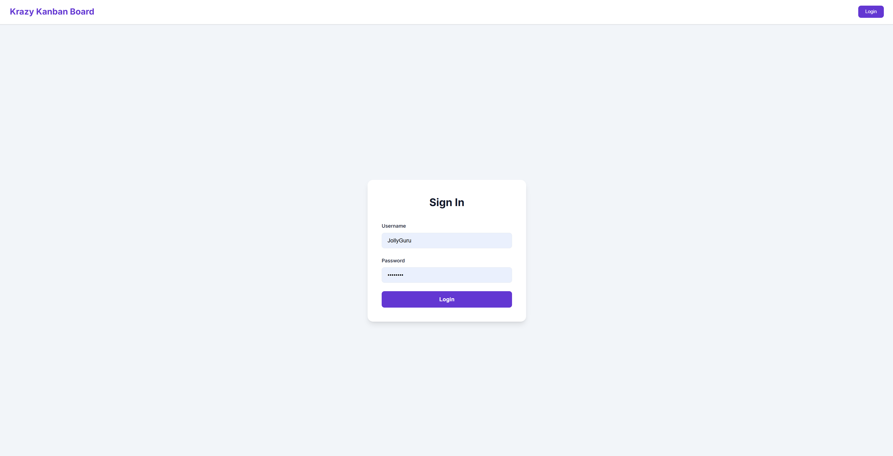
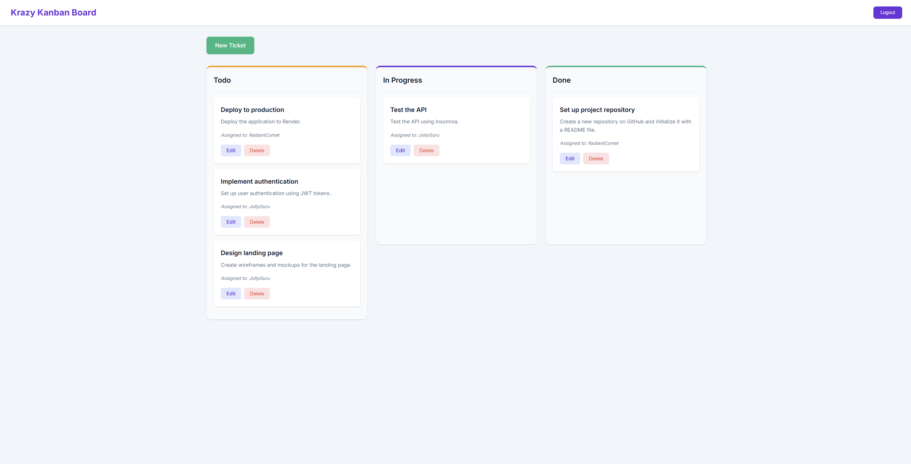
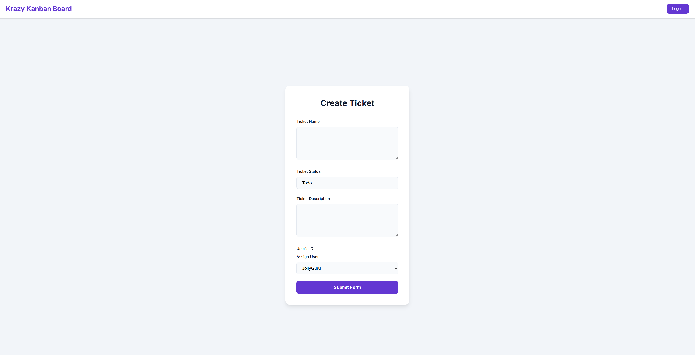

# Task Management System with JWT Authentication

## Description

A secure task management application built with the PERN stack (PostgreSQL, Express, React, Node.js) featuring JWT authentication. Users can create, manage, and track tasks through different workflow stages while ensuring data security through token-based authentication.

## Table of Contents

- [Task Management System with JWT Authentication](#task-management-system-with-jwt-authentication)
  - [Description](#description)
  - [Table of Contents](#table-of-contents)
  - [Installation](#installation)
  - [Configuration](#configuration)
  - [Usage](#usage)
  - [Features](#features)
  - [Technologies Used](#technologies-used)
  - [API Routes](#api-routes)
    - [Authentication](#authentication)
    - [Tasks (Protected)](#tasks-protected)
    - [Users (Protected)](#users-protected)
  - [Screenshots](#screenshots)
  - [Deployment](#deployment)
  - [Contributing](#contributing)
  - [License](#license)

## Installation

```bash
# Clone the repository
git clone https://github.com/sheikh03/challenge-14.git
cd challenge-13

# Install all dependencies
npm install

# Create PostgreSQL database
createdb task_manager_db

# Seed the database
npm run seed

# Start development server
npm run start:dev
```

## Configuration

Create a `.env` file in the server directory:

```env
DB_NAME='task_manager_db'
DB_USER='postgres'
DB_PASSWORD='your_password'
JWT_SECRET_KEY='your-secret-key-here'
```

## Usage

1. Navigate to [http://localhost:3000](http://localhost:3000)
2. Login with seeded credentials:
   - Username: `JollyGuru`, Password: `password`
   - Username: `RadiantComet`, Password: `password`
   - Username: `SunnyScribe`, Password: `password`
3. Create, edit, and manage tasks
4. Tasks move through Todo → In Progress → Done stages

## Features

- JWT-based authentication system
- Protected API routes
- Task CRUD operations
- User assignment system
- Responsive design
- Session management with token expiration
- Secure password hashing with bcrypt

## Technologies Used

**Frontend:**

- React 18 with TypeScript
- React Router DOM
- JWT-decode
- Vite

**Backend:**

- Node.js & Express
- TypeScript
- PostgreSQL
- Sequelize ORM
- JSON Web Tokens
- Bcrypt

## API Routes

### Authentication

- `POST /auth/login` - User authentication

### Tasks (Protected)

- `GET /api/tickets` - Retrieve all tasks
- `GET /api/tickets/:id` - Get specific task
- `POST /api/tickets` - Create new task
- `PUT /api/tickets/:id` - Update task
- `DELETE /api/tickets/:id` - Remove task

### Users (Protected)

- `GET /api/users` - List all users
- `GET /api/users/:id` - Get user details

## Screenshots





## Deployment

The application is deployed on Render:

- Live URL: [https://challenge-13-task-manager.onrender.com](https://challenge-14.onrender.com)

## Contributing

1. Fork the repository
2. Create a feature branch
3. Commit your changes
4. Push to the branch
5. Open a Pull Request

## License

This project is licensed under the MIT License - see the [LICENSE](LICENSE) file for details.

---

**Author**: Sheikh Iftekhar
**Email**: <sheikhiftekhar03@gmail.com>
**GitHub**: [@sheikh03](https://github.com/sheikh03)
